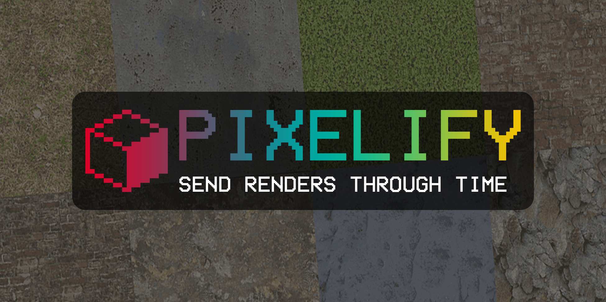

Pixelify - Send Your Renders Through
=============

**Pixelify** is your ultimate pixel art solution. It instantly transforms renders into authentic retro masterpieces with professional precision, giving you complete control over the pixelation journey.

Features
--------

* **One-Click Conversion**: Transform any texture or render into pixel art instantly.
* **Advanced Dithering Engine**: Choose from multiple dithering algorithms (Bayer, Floyd-Steinberg, Median-Cut).
* **Batch Processing**: Convert multiple textures at once with the same settings.
* **Smart Sampling**: Multiple sampling modes from nearest neighbor to advanced Lanczos filtering.
* **Custom Color Palettes**: Use the built-in palette or create your own.
* **Color Adjustments**: Fine-tune brightness, contrast, saturation, gamma, and hue.
* **Preset System**: Save and load your favorite pixel art settings.
* **Non-Destructive Workflow**: Easily revert to original textures anytime.
* **Performance Tracking**: Smart logging system for optimizing your workflow.

Support
-------

If you have any questions get in touch via :doc:`contact`.

Contents
--------

.. toctree::
   :maxdepth: 2

   installation
   main_panel
   sampling_filters
   dithering
   palette
   color_adjustments
   changelog
   contact
